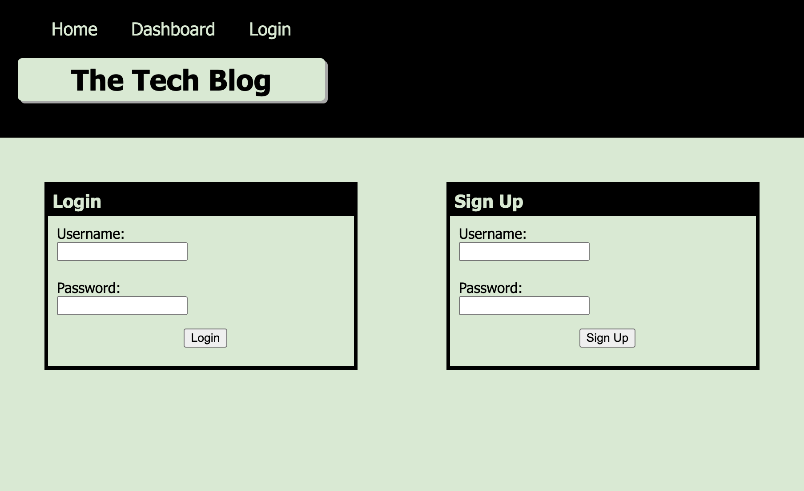

# Tech Blog

## Table of Contents
- [Description](#description)
- [Learning Points](#learning-points)
- [Technology Used](#technology-used)
- [Deployment](#deployment)
- [Author](#author)
- [License](#license)

## Description

Welcome to the Tech Blog, a web application that combines the power of Node.js, Express.js, Sequelize, and Handlebars to create a dynamic and interactive platform for sharing and discussing all things tech-related. Whether you're a developer, tech enthusiast, or simply curious about the latest trends in the tech industry, this blog is your go-to source for insightful articles and engaging discussions.

 

## Learning Points

- How to use Handlebars.
- How to use a SQL Database.
- How to use Sequelize.
- How to use RESTful Routes.

 

## Technology Used

 

| Technology Used | Resource URL                                                      |
| --------------- | ----------------------------------------------------------------- |
| SQL Tutorial | [https://www.w3schools.com/sql/](https://www.w3schools.com/sql/) |
| Model Basics | [https://sequelize.org/docs/v6/core-concepts/model-basics/](https://sequelize.org/docs/v6/core-concepts/model-basics/) |
| Built-in Helpers | [https://handlebarsjs.com/guide/builtin-helpers.html#if](https://handlebarsjs.com/guide/builtin-helpers.html#if) |

 

## Deployment

Website URL: [Tech Blog](https://boiling-garden-22279-8abc1c9e4fe7.herokuapp.com/)

 

## Author

### Lainey Creighton

 

[dev.lainey@gmail.com](dev.lainey@gmail.com)
 
 

 

[https://www.linkedin.com/in/lainey-creighton/](https://www.linkedin.com/in/lainey-creighton/)
 
 

 

[https://github.com/laineycreighton](https://github.com/laineycreighton)

 

## License

N/A